# 🏗️ ARCHITECTURE TECHNIQUE SAAS-TOOL
## Schéma d'Architecture Logicielle avec Technologies et Liens

---

## 📊 **ARCHITECTURE GLOBALE**


---

## 🔄 **FLUX DE DONNÉES - SÉQUENCE UTILISATEUR**

```mermaid
sequenceDiagram
    participant User as 👤 Utilisateur
    participant UI as 🎨 React UI
    participant Gateway as 🚪 API Gateway
    participant Auth as 🔐 Auth Service
    participant Service as 🔧 Core Service
    participant Primary as 💾 PostgreSQL Primary
    participant Secondary as 💾 PostgreSQL Secondary
    participant Cache as ⚡ Redis
    participant External as 🌐 External API

    User->>UI: Action (ex: Créer utilisateur)
    UI->>Gateway: HTTP Request + JWT Token
    Gateway->>Auth: Validate JWT + MFA
    Auth-->>Gateway: Token Valid + client_id
    Gateway->>Gateway: Inject client_id (Multi-tenant)
    Gateway->>Service: Route to User Life Cycle Service
    Service->>Cache: Check cached data
    Cache-->>Service: Cache miss/hit
    Service->>Primary: Write Query with client_id filter
    Primary->>Secondary: Streaming Replication
    Service->>Secondary: Read Query (if applicable)
    Secondary-->>Service: Filtered tenant data
    Service->>External: Call M365/Google API
    External-->>Service: API Response
    Service->>Primary: Update with client_id
    Primary->>Secondary: Replicate changes
    Service->>Cache: Update cache
    Service-->>Gateway: Response
    Gateway-->>UI: JSON Response
    UI-->>User: Updated Interface
```



---

## 🏢 **ARCHITECTURE MULTI-TENANT SÉCURISÉE**


---

## 🔒 **ARCHITECTURE BASE DE DONNÉES SÉCURISÉE**

```mermaid
graph TB
    subgraph "🛡️ RÉSEAU SÉCURISÉ"
        subgraph "🔒 VLAN CLUSTER POSTGRESQL"
            subgraph "⚡ CLUSTER HA CONFIGURATION"
                PRIMARY[PostgreSQL Primary<br/>🔴 Read/Write<br/>sync_commit=on]
                SECONDARY[PostgreSQL Secondary<br/>🟡 Hot Standby<br/>streaming replication]
                REPLICA[PostgreSQL Replica<br/>🟢 Read Only<br/>load balancing]
            end
            
            subgraph "🤖 AUTO-FAILOVER"
                PATRONI[Patroni Leader<br/>Health Monitoring]
                ETCD[etcd Cluster<br/>Consensus & Config]
                PGBOUNCER[PgBouncer<br/>Connection Pooling]
            end
        end
        
        subgraph "⚡ CACHE LAYER"
            REDIS_SIMPLE[Redis Simple Instance<br/>🔵 Cache + Sessions<br/>Non-Critical Data]
        end
        
        subgraph "🔐 VAULT CLUSTER"
            VAULT_PRIMARY[Vault Primary<br/>Secrets Management]
            VAULT_STORAGE[Encrypted Storage<br/>AES-256]
        end
    end
    
    subgraph "🌐 APPLICATION LAYER"
        BACKEND[FastAPI Services<br/>Multi-Tenant]
        FRONTEND[React UI<br/>Cache Layer]
    end
    
    subgraph "🔒 SECURITY CONTROLS"
        FIREWALL[Restrictive Firewall<br/>Whitelist Backend Only]
        VPN[Site-to-Site VPN<br/>Admin Access]
        BASTION[Bastion Host<br/>Maintenance]
    end
    
    %% Connections
    BACKEND --> PGBOUNCER
    PGBOUNCER --> PRIMARY
    PGBOUNCER --> REPLICA
    PRIMARY --> SECONDARY
    SECONDARY --> REPLICA
    PATRONI --> PRIMARY
    PATRONI --> SECONDARY
    PATRONI --> ETCD
    
    FRONTEND --> REDIS_SIMPLE
    BACKEND --> REDIS_SIMPLE
    
    BACKEND --> VAULT_PRIMARY
    VAULT_PRIMARY --> VAULT_STORAGE
    
    FIREWALL --> PRIMARY
    FIREWALL --> SECONDARY
    VPN --> BASTION
    BASTION --> PATRONI
```



---

## 🔧 **DÉTAIL STACK TECHNOLOGIQUE**

### **Frontend Stack**
```yaml
Core Framework:
  - React 18+ (TypeScript)
  - Vite (Build tool + HMR)
  - React Router (SPA routing)

UI/UX:
  - Tailwind CSS (Utility-first)
  - Shadcn/ui (Component library)
  - Radix UI (Accessible primitives)
  - React Hook Form (Form management)

State Management:
  - Zustand (Lightweight state)
  - React Query (Server state)
  - Context API (Theme, auth)

No-Code Interface:
  - React Flow (Drag & drop workflows)
  - Monaco Editor (Code editor)
  - Recharts (Data visualization)

Caching Strategy:
  - Redis Simple Instance (Sessions, UI cache)
  - Browser localStorage (User preferences)
  - React Query cache (API responses)
```

### **Backend Stack**
```yaml
Core Framework:
  - FastAPI (Python web framework)
  - Pydantic (Data validation)
  - SQLAlchemy (ORM)
  - Alembic (Database migrations)

Authentication:
  - JWT (JSON Web Tokens)
  - OAuth2 (External providers)
  - Passlib (Password hashing)
  - Python-JOSE (JWT handling)

Task Processing:
  - Celery (Distributed task queue)
  - Redis Simple Instance (Message broker)
  - APScheduler (Scheduled tasks)

API Documentation:
  - OpenAPI 3.0 (Auto-generated docs)
  - Swagger UI (Interactive docs)
  - ReDoc (Alternative docs)
```

### **Database Stack - SÉCURITÉ MAXIMALE**
```yaml
Primary Database - PostgreSQL Cluster HA:
  - PostgreSQL 15+ (ACID compliance)
  - Patroni (Auto-failover orchestration)
  - etcd (Distributed consensus)
  - PgBouncer (Connection pooling)
  - Streaming Replication (Synchronous)
  - Row Level Security (Multi-tenant isolation)
  - pgaudit (Comprehensive audit logging)
  - pg_crypto (Column-level encryption)

Configuration Sécurisée:
  - ssl = on (TLS 1.3 encryption)
  - synchronous_commit = on (Data consistency)
  - wal_level = replica (Replication support)
  - max_wal_senders = 5 (Multiple replicas)
  - hot_standby = on (Read queries on standby)

Backup Strategy:
  - WAL-E/WAL-G (Continuous archiving)
  - Point-in-time recovery (PITR)
  - Encrypted backups (AES-256)
  - Cross-region replication
  - Automated restore testing

Caching Layer - Simple & Efficace:
  - Redis 7+ (Single instance)
  - Sessions storage (JWT tokens)
  - API response cache (TTL-based)
  - Rate limiting counters
  - Task queue (Celery broker)

Connection Management:
  - asyncpg (Async PostgreSQL driver)
  - PgBouncer (Connection pooling)
  - redis-py (Redis Python client)
  - Health checks (Patroni integration)
```

### **Integration Stack**
```yaml
Infrastructure as Code:
  - Terraform 1.5+ (Multi-cloud IaC)
  - Ansible 2.15+ (Configuration management)
  - Python 3.11+ (Orchestration scripts)

Cloud SDKs:
  - Azure SDK for Python
  - Boto3 (AWS SDK)
  - Google Cloud Client Libraries
  - VMware vSphere API Python bindings

API Clients:
  - httpx (Async HTTP client)
  - requests (Sync HTTP client)
  - websockets (Real-time communication)
```

### **Security Stack**
```yaml
Encryption:
  - cryptography (Python crypto library)
  - AES-256-GCM (Symmetric encryption)
  - RSA-4096 (Asymmetric encryption)
  - bcrypt (Password hashing)

Secrets Management:
  - HashiCorp Vault (Centralized secrets)
  - Vault Auto-Unseal (Cloud KMS)
  - Dynamic secrets (Database credentials)
  - Secret rotation (Automated)

Database Security:
  - Row Level Security (RLS)
  - Column-level encryption (pg_crypto)
  - Audit logging (pgaudit)
  - SSL/TLS encryption (all connections)
  - Network isolation (VLAN segmentation)

Monitoring:
  - structlog (Structured logging)
  - prometheus-client (Metrics)
  - opentelemetry (Distributed tracing)
```

---

## 🔗 **INTÉGRATIONS EXTERNES DÉTAILLÉES**

### **Microsoft 365 Integration**
```yaml
Technologies:
  - Microsoft Graph API (REST)
  - PowerShell Core (Scripts)
  - Azure AD Graph (Legacy support)
  - Microsoft Graph SDK for Python

Fonctionnalités:
  - User provisioning (Create/Update/Delete)
  - License management (Assign/Remove)
  - Group membership (Security/Distribution)
  - Exchange Online (Mailbox management)
  - SharePoint (Site provisioning)
  - Teams (Team creation/management)

Authentication:
  - Azure AD App Registration
  - Client Credentials Flow
  - Certificate-based auth
  - Scoped permissions

Sécurité:
  - Credentials stockés dans Vault
  - Rotation automatique des secrets
  - Audit trail des opérations
  - Rate limiting API calls
```

### **Google Workspace Integration**
```yaml
Technologies:
  - Google Admin SDK (Python)
  - Google Workspace APIs
  - Service Account authentication
  - Domain-wide delegation

Fonctionnalités:
  - User lifecycle (Create/Update/Suspend)
  - Organizational Units (Structure)
  - Groups management (Security/Distribution)
  - Gmail settings (Aliases, forwarding)
  - Drive management (Shared drives)
  - Calendar resources (Rooms, equipment)

Authentication:
  - Service Account JSON key (Vault-stored)
  - OAuth2 domain-wide delegation
  - Scoped API access

Sécurité:
  - Service Account keys in Vault
  - Minimal required scopes
  - Audit logging all operations
  - IP restrictions where possible
```

### **Infrastructure Cloud Integration**
```yaml
Azure Integration:
  - Azure Resource Manager (ARM)
  - Azure CLI (Command-line)
  - Azure SDK for Python
  - Azure PowerShell (Hybrid)
  - Terraform Azure Provider

AWS Integration:
  - Boto3 SDK (Python)
  - AWS CLI (Command-line)
  - CloudFormation (IaC)
  - AWS Systems Manager
  - Terraform AWS Provider

GCP Integration:
  - Google Cloud SDK
  - Cloud Client Libraries (Python)
  - gcloud CLI
  - Deployment Manager
  - Terraform GCP Provider

Common Patterns:
  - Terraform providers (Unified IaC)
  - Ansible modules (Configuration)
  - Python wrappers (Abstraction layer)
  - Credential management (Vault integration)
  - Multi-cloud abstraction (Common interfaces)

Sécurité Multi-Cloud:
  - Service Principal/Service Accounts in Vault
  - Least privilege access policies
  - Network segmentation (VPN/Private endpoints)
  - Audit trail cross-cloud operations
  - Cost monitoring and alerting
```

### **Virtualisation On-Premise**
```yaml
VMware vSphere:
  - vSphere API (REST/SOAP)
  - PowerCLI (PowerShell)
  - pyvmomi (Python SDK)
  - vCenter Server integration
  - Terraform VMware Provider

Proxmox:
  - Proxmox VE API (REST)
  - pvesh CLI tool
  - Python proxmoxer library
  - QEMU/LXC management
  - Terraform Proxmox Provider

Hyper-V:
  - PowerShell Hyper-V module
  - WMI (Windows Management)
  - System Center integration
  - PowerShell Direct

Common Operations:
  - VM lifecycle (Create/Start/Stop/Delete)
  - Resource allocation (CPU/RAM/Storage)
  - Network configuration (vSwitches/VLANs)
  - Backup/Snapshot management
  - Performance monitoring

Sécurité On-Premise:
  - Dedicated service accounts (Vault-managed)
  - Network isolation (VLANs/Firewalls)
  - Certificate-based authentication
  - Audit logging all operations
  - Secure credential rotation
```

---

## 🎯 **PATTERNS ARCHITECTURAUX**

### **1. Multi-Tenant Pattern avec Cluster HA**
```python
# Middleware d'injection client_id avec load balancing
@app.middleware("http")
async def tenant_middleware(request: Request, call_next):
    # Extract tenant from JWT token
    tenant_id = extract_tenant_from_jwt(request.headers.get("Authorization"))
    # Inject into request context
    request.state.tenant_id = tenant_id
    # Set database session context for RLS
    await set_database_context(tenant_id)
    response = await call_next(request)
    return response

# Modèle avec isolation automatique et cluster support
class BaseModel(SQLAlchemyBase):
    client_id = Column(String, nullable=False, index=True)
    
    @classmethod
    def filter_by_tenant(cls, query, tenant_id):
        return query.filter(cls.client_id == tenant_id)
    
    @classmethod
    async def get_connection(cls, read_only=False):
        """Get appropriate database connection"""
        if read_only:
            return get_read_replica_connection()
        return get_primary_connection()

# Row Level Security automatique
async def enable_rls_for_tenant(tenant_id: str):
    """Enable Row Level Security for tenant context"""
    await database.execute(
        "SET app.current_tenant = :tenant_id",
        {"tenant_id": tenant_id}
    )
```

### **2. Secure Credential Management avec Vault**
```python
# Coffre-fort pour credentials externes avec rotation
class CredentialVault:
    def __init__(self, vault_client):
        self.vault = vault_client
    
    async def store_credential(self, tenant_id: str, platform: str, credential: dict):
        """Store encrypted credential with automatic rotation"""
        # Double encryption: Vault + tenant-specific key
        tenant_key = await self.get_tenant_key(tenant_id)
        encrypted_data = self.encrypt_with_tenant_key(credential, tenant_key)
        
        path = f"tenant/{tenant_id}/platforms/{platform}"
        await self.vault.write(path, {
            "data": encrypted_data,
            "rotation_policy": "30d",
            "created_at": datetime.utcnow().isoformat()
        })
    
    async def get_credential(self, tenant_id: str, platform: str):
        """Retrieve and decrypt credential"""
        path = f"tenant/{tenant_id}/platforms/{platform}"
        vault_data = await self.vault.read(path)
        
        tenant_key = await self.get_tenant_key(tenant_id)
        return self.decrypt_with_tenant_key(vault_data["data"], tenant_key)
    
    async def rotate_credentials(self, tenant_id: str, platform: str):
        """Automatic credential rotation"""
        connector = ConnectorFactory.create_connector(platform)
        new_credential = await connector.rotate_credential()
        await self.store_credential(tenant_id, platform, new_credential)
        
        # Audit log
        await self.audit_log(f"Credential rotated: {tenant_id}/{platform}")
```

### **3. Database Cluster Management**
```python
# Connection management avec cluster PostgreSQL
class DatabaseManager:
    def __init__(self):
        self.primary_pool = None
        self.replica_pools = []
        self.patroni_client = PatroniClient()
    
    async def get_connection(self, read_only=False, tenant_id=None):
        """Get appropriate database connection with tenant context"""
        if read_only and self.replica_pools:
            # Load balance across read replicas
            pool = random.choice(self.replica_pools)
        else:
            # Use primary for writes
            pool = self.primary_pool
        
        conn = await pool.acquire()
        
        # Set tenant context for Row Level Security
        if tenant_id:
            await conn.execute(
                "SET app.current_tenant = $1", tenant_id
            )
        
        return conn
    
    async def handle_failover(self):
        """Handle automatic failover"""
        current_primary = await self.patroni_client.get_primary()
        if current_primary != self.current_primary:
            logger.info(f"Failover detected: {self.current_primary} -> {current_primary}")
            await self.reconnect_to_new_primary(current_primary)
            await self.notify_monitoring("database_failover", {
                "old_primary": self.current_primary,
                "new_primary": current_primary
            })

# Health monitoring cluster
@background_task
async def monitor_cluster_health():
    """Monitor PostgreSQL cluster health"""
    while True:
        try:
            # Check primary health
            primary_status = await check_primary_health()
            # Check replication lag
            replication_lag = await check_replication_lag()
            # Check connection pools
            pool_status = await check_connection_pools()
            
            # Alert if issues detected
            if replication_lag > timedelta(seconds=30):
                await send_alert("High replication lag detected", {
                    "lag": str(replication_lag),
                    "threshold": "30s"
                })
                
        except Exception as e:
            logger.error(f"Cluster monitoring error: {e}")
        
        await asyncio.sleep(30)  # Check every 30 seconds
```

### **4. Universal Connector Pattern avec Sécurité**
```python
# Interface commune pour toutes les plateformes avec sécurité
class PlatformConnector(ABC):
    def __init__(self, tenant_id: str, vault: CredentialVault):
        self.tenant_id = tenant_id
        self.vault = vault
        self.audit_logger = AuditLogger(tenant_id)
    
    @abstractmethod
    async def create_user(self, user_data: UserData) -> UserResult:
        pass
    
    @abstractmethod
    async def delete_user(self, user_id: str) -> bool:
        pass
    
    async def get_credentials(self, platform: str):
        """Secure credential retrieval"""
        try:
            credentials = await self.vault.get_credential(self.tenant_id, platform)
            await self.audit_logger.log("credential_accessed", {
                "platform": platform,
                "action": "retrieve"
            })
            return credentials
        except Exception as e:
            await self.audit_logger.log("credential_access_failed", {
                "platform": platform,
                "error": str(e)
            })
            raise

# Implémentation M365 avec sécurité renforcée
class M365Connector(PlatformConnector):
    async def create_user(self, user_data: UserData) -> UserResult:
        credentials = await self.get_credentials("m365")
        
        try:
            # Initialize Graph client with secure credentials
            graph_client = GraphServiceClient(credentials)
            
            # Create user with audit trail
            result = await graph_client.users.post(user_data.to_graph_user())
            
            await self.audit_logger.log("user_created", {
                "platform": "m365",
                "user_id": result.id,
                "user_email": user_data.email
            })
            
            return UserResult.from_graph_user(result)
            
        except Exception as e:
            await self.audit_logger.log("user_creation_failed", {
                "platform": "m365",
                "user_email": user_data.email,
                "error": str(e)
            })
            raise
```

### **5. Event-Driven Automation avec Résilience**
```python
# Système d'événements pour workflows avec cluster support
class WorkflowEngine:
    def __init__(self, event_bus: EventBus, database: DatabaseManager):
        self.event_bus = event_bus
        self.database = database
        self.handlers = {}
    
    async def process_workflow(self, workflow: Workflow, context: dict):
        """Process workflow with database transactions"""
        async with self.database.get_connection() as conn:
            async with conn.transaction():
                try:
                    for step in workflow.steps:
                        # Store workflow state in database
                        await self.save_workflow_state(conn, workflow.id, step.id, "processing")
                        
                        event = WorkflowStepEvent(step, context)
                        await self.event_bus.publish(event)
                        
                        result = await self.wait_for_result(event.id, timeout=300)
                        context.update(result)
                        
                        # Update workflow state
                        await self.save_workflow_state(conn, workflow.id, step.id, "completed")
                        
                except Exception as e:
                    # Mark workflow as failed
                    await self.save_workflow_state(conn, workflow.id, step.id, "failed")
                    # Trigger compensation/rollback
                    await self.trigger_compensation(workflow, step)
                    raise

# Handler pour étape spécifique avec retry logic
@event_handler("user.create")
@retry(max_attempts=3, backoff=exponential_backoff)
async def handle_user_creation(event: UserCreateEvent):
    """Handle user creation with retry and audit"""
    connector = ConnectorFactory.create_connector(
        event.platform, 
        event.tenant_id,
        vault_client
    )
    
    try:
        result = await connector.create_user(event.user_data)
        
        # Store result in database with tenant isolation
        async with database.get_connection(tenant_id=event.tenant_id) as conn:
            await store_user_creation_result(conn, event, result)
        
        return result
        
    except Exception as e:
        # Log failure for monitoring
        await audit_logger.log("user_creation_failed", {
            "tenant_id": event.tenant_id,
            "platform": event.platform,
            "error": str(e),
            "retry_count": event.retry_count
        })
        raise
```

### **6. Observability Pattern avec Cluster Monitoring**
```python
# Instrumentation automatique avec cluster awareness
from opentelemetry import trace
from prometheus_client import Counter, Histogram, Gauge

# Métriques business et infrastructure
user_operations = Counter('user_operations_total', ['operation', 'platform', 'tenant'])
api_duration = Histogram('api_request_duration_seconds', ['endpoint', 'method'])
db_connections = Gauge('database_connections_active', ['node_type', 'database'])
cluster_health = Gauge('postgresql_cluster_health', ['node', 'role'])

@trace.instrument()
@api_duration.time()
async def create_user_endpoint(user_data: UserData, tenant_id: str):
    span = trace.get_current_span()
    span.set_attribute("tenant.id", tenant_id)
    span.set_attribute("user.email", user_data.email)
    span.set_attribute("database.node", "primary")
    
    try:
        # Monitor database connection
        db_connections.labels(node_type="primary", database="main").inc()
        
        result = await user_service.create_user(user_data, tenant_id)
        
        # Update business metrics
        user_operations.labels(
            operation='create', 
            platform=user_data.platform,
            tenant=tenant_id
        ).inc()
        
        return result
        
    except Exception as e:
        span.record_exception(e)
        span.set_status(trace.Status(trace.StatusCode.ERROR))
        
        # Monitor error rates
        user_operations.labels(
            operation='create_failed',
            platform=user_data.platform,
            tenant=tenant_id
        ).inc()
        
        raise
    finally:
        db_connections.labels(node_type="primary", database="main").dec()

# Monitoring cluster health
@background_task
async def update_cluster_metrics():
    """Update PostgreSQL cluster health metrics"""
    while True:
        try:
            patroni_status = await patroni_client.get_cluster_status()
            
            for node in patroni_status.nodes:
                cluster_health.labels(
                    node=node.name,
                    role=node.role
                ).set(1 if node.healthy else 0)
                
        except Exception as e:
            logger.error(f"Failed to update cluster metrics: {e}")
        
        await asyncio.sleep(30)
```

---

## 📊 **MÉTRIQUES & MONITORING SÉCURISÉ**

### **Application Metrics**
```yaml
Business Metrics:
  - user_operations_total (Counter)
  - workflow_executions_total (Counter)
  - platform_integrations_success_rate (Gauge)
  - tenant_active_users (Gauge)

Performance Metrics:
  - api_request_duration_seconds (Histogram)
  - database_query_duration_seconds (Histogram)
  - external_api_call_duration_seconds (Histogram)
  - cache_hit_ratio (Gauge)

Database Cluster Metrics:
  - postgresql_cluster_health (Gauge per node)
  - postgresql_replication_lag_seconds (Gauge)
  - postgresql_connections_active (Gauge per node)
  - postgresql_failover_count (Counter)
  - patroni_cluster_status (Gauge)

System Metrics:
  - cpu_usage_percent (Gauge)
  - memory_usage_bytes (Gauge)
  - disk_io_operations_total (Counter)
  - network_bytes_transmitted_total (Counter)

Security Metrics:
  - authentication_attempts_total (Counter)
  - authorization_failures_total (Counter)
  - credential_rotations_total (Counter)
  - audit_events_total (Counter)
```

### **Alerting Rules - Sécurité Focus**
```yaml
Critical Alerts - Sécurité:
  - PostgreSQL primary node down
  - Replication lag > 30 seconds
  - Failover triggered
  - Vault seal status changed
  - Authentication failure rate > 10%
  - Unauthorized access attempts

Critical Alerts - Performance:
  - API error rate > 5% (5min window)
  - Database connection pool exhausted
  - External API failure rate > 10%
  - Memory usage > 85%

Warning Alerts:
  - API response time > 2s (P95)
  - Cache hit ratio < 80%
  - Disk usage > 80%
  - Queue length > 1000 tasks
  - Replication lag > 10 seconds
  - Connection pool utilization > 70%
```

---

## 🚀 **PATTERNS DE DÉPLOIEMENT SÉCURISÉ**

### **Blue/Green Deployment avec Cluster**
```yaml
Infrastructure:
  - 2 environnements identiques (Blue/Green)
  - PostgreSQL cluster per environment
  - Shared Vault cluster (cross-environment)
  - Load balancer avec switch instantané
  - Database migration strategy with rollback

Process:
  1. Deploy sur environnement inactif
  2. Database migration (avec backup point)
  3. Tests automatisés complets (including cluster failover)
  4. Switch traffic progressif (10%/50%/100%)
  5. Monitoring metrics critiques (cluster health)
  6. Rollback si dégradation détectée
```

### **Database Versioning avec Cluster Support**
```python
# Migration Alembic avec multi-tenant et cluster
def upgrade():
    """Migration with cluster awareness"""
    # Check cluster status before migration
    if not check_cluster_healthy():
        raise Exception("Cluster not healthy, aborting migration")
    
    # Migration schema global sur primary
    op.create_table('new_feature_table',
        sa.Column('id', sa.Integer, primary_key=True),
        sa.Column('client_id', sa.String(50), nullable=False, index=True),
        sa.Column('data', sa.JSON),
        sa.Column('created_at', sa.DateTime, default=func.now()),
        sa.Column('updated_at', sa.DateTime, default=func.now(), onupdate=func.now())
    )
    
    # Index pour performance multi-tenant
    op.create_index('idx_new_feature_client_id', 'new_feature_table', ['client_id'])
    op.create_index('idx_new_feature_created_at', 'new_feature_table', ['created_at'])
    
    # Partitioning pour scalabilité
    op.execute("""
        -- Enable partitioning by client_id
        ALTER TABLE new_feature_table PARTITION BY HASH (client_id);
        
        -- Create initial partitions
        CREATE TABLE new_feature_table_p0 PARTITION OF new_feature_table
        FOR VALUES WITH (MODULUS 4, REMAINDER 0);
        
        CREATE TABLE new_feature_table_p1 PARTITION OF new_feature_table
        FOR VALUES WITH (MODULUS 4, REMAINDER 1);
        
        CREATE TABLE new_feature_table_p2 PARTITION OF new_feature_table
        FOR VALUES WITH (MODULUS 4, REMAINDER 2);
        
        CREATE TABLE new_feature_table_p3 PARTITION OF new_feature_table
        FOR VALUES WITH (MODULUS 4, REMAINDER 3);
    """)
    
    # Row Level Security automatique
    op.execute("""
        ALTER TABLE new_feature_table ENABLE ROW LEVEL SECURITY;
        
        CREATE POLICY tenant_isolation ON new_feature_table 
        FOR ALL TO application_role 
        USING (client_id = current_setting('app.current_tenant'));
        
        -- Grant permissions
        GRANT SELECT, INSERT, UPDATE, DELETE ON new_feature_table TO application_role;
    """)
    
    # Wait for replication to catch up
    op.execute("SELECT pg_sleep(5);")
    
    # Verify migration on all nodes
    verify_migration_replicated()

def verify_migration_replicated():
    """Verify migration is replicated to all cluster nodes"""
    # Check table exists on all nodes
    # Verify RLS policies are active
    # Confirm indexes are created
    pass
```

### **Backup Strategy Cluster-Aware**
```yaml
Backup Configuration:
  Primary Backups:
    - WAL-E continuous archiving
    - Point-in-time recovery (PITR)
    - Full backup daily at 2 AM UTC
    - Incremental WAL shipping every 30s
    
  Secondary Backups:
    - Logical backups via pg_dump
    - Cross-region replication
    - Snapshot-based backups
    
  Disaster Recovery:
    - RTO: < 5 minutes (automated failover)
    - RPO: < 1 minute (synchronous replication)
    - Geographic distribution (EU regions)
    - Automated restore testing weekly

Security:
  - All backups encrypted (AES-256)
  - Backup verification automated
  - Access logs for all backup operations
  - Retention policy: 30d/12m/7y
```

---

## 🎯 **CONFIGURATION SYSTÈME SÉCURISÉ**

### **PostgreSQL Cluster Configuration**
```yaml
# postgresql.conf - Primary Node
listen_addresses = '*'
port = 5432
max_connections = 200
shared_buffers = 256MB
effective_cache_size = 1GB
work_mem = 4MB
maintenance_work_mem = 64MB

# Replication settings
wal_level = replica
max_wal_senders = 5
max_replication_slots = 5
synchronous_commit = on
synchronous_standby_names = 'secondary'

# Security settings
ssl = on
ssl_cert_file = '/etc/ssl/certs/postgresql.crt'
ssl_key_file = '/etc/ssl/private/postgresql.key'
ssl_ca_file = '/etc/ssl/certs/ca.crt'
ssl_crl_file = '/etc/ssl/certs/ca.crl'

# Logging for audit
log_destination = 'csvlog'
logging_collector = on
log_directory = '/var/log/postgresql'
log_filename = 'postgresql-%Y-%m-%d_%H%M%S.log'
log_statement = 'all'
log_connections = on
log_disconnections = on
log_duration = on
log_line_prefix = '%t [%p-%l] %q%u@%d '

# Row Level Security
row_security = on

# pg_hba.conf - Authentication
hostssl all application_role 10.0.0.0/8 cert
hostssl replication replicator 10.0.0.0/8 cert
host all postgres 127.0.0.1/32 trust
```

### **Patroni Configuration**
```yaml
# patroni.yml
scope: saas-tool-cluster
namespace: /db/
name: postgresql-primary

restapi:
  listen: 0.0.0.0:8008
  connect_address: 10.0.1.10:8008

etcd:
  hosts: 
    - 10.0.1.20:2379
    - 10.0.1.21:2379
    - 10.0.1.22:2379

bootstrap:
  dcs:
    ttl: 30
    loop_wait: 10
    retry_timeout: 30
    maximum_lag_on_failover: 1048576
    synchronous_mode: true
    synchronous_mode_strict: true
    postgresql:
      use_pg_rewind: true
      use_slots: true
      parameters:
        max_connections: 200
        shared_buffers: 256MB
        synchronous_commit: on
        wal_level: replica
        hot_standby: on
        max_wal_senders: 5
        ssl: on
        row_security: on

postgresql:
  listen: 0.0.0.0:5432
  connect_address: 10.0.1.10:5432
  data_dir: /var/lib/postgresql/15/main
  bin_dir: /usr/lib/postgresql/15/bin
  config_dir: /etc/postgresql/15/main
  pgpass: /var/lib/postgresql/.pgpass
  authentication:
    replication:
      username: replicator
      password: "{{ vault_replication_password }}"
    superuser:
      username: postgres
      password: "{{ vault_postgres_password }}"
  parameters:
    unix_socket_directories: '/var/run/postgresql'
    ssl_cert_file: '/etc/ssl/certs/postgresql.crt'
    ssl_key_file: '/etc/ssl/private/postgresql.key'

tags:
  nofailover: false
  noloadbalance: false
  clonefrom: false
  nosync: false
```

### **Network Security Configuration**
```yaml
# Firewall Rules (iptables)
# PostgreSQL Cluster
-A INPUT -s 10.0.1.0/24 -p tcp --dport 5432 -j ACCEPT
-A INPUT -s 10.0.1.0/24 -p tcp --dport 8008 -j ACCEPT  # Patroni API

# etcd Cluster
-A INPUT -s 10.0.1.0/24 -p tcp --dport 2379 -j ACCEPT
-A INPUT -s 10.0.1.0/24 -p tcp --dport 2380 -j ACCEPT

# Redis (Backend only)
-A INPUT -s 10.0.2.0/24 -p tcp --dport 6379 -j ACCEPT

# Vault
-A INPUT -s 10.0.1.0/24 -p tcp --dport 8200 -j ACCEPT

# Drop all other traffic
-A INPUT -j DROP

# VPN Configuration (WireGuard)
[Interface]
PrivateKey = {{ vault_wireguard_private_key }}
Address = 10.100.0.1/24
ListenPort = 51820

[Peer]
# Admin access
PublicKey = {{ admin_public_key }}
AllowedIPs = 10.100.0.2/32

[Peer]
# Monitoring access
PublicKey = {{ monitoring_public_key }}
AllowedIPs = 10.100.0.3/32
```

---

**🎯 Cette architecture technique mise à jour offre une sécurité maximale des données avec un cluster PostgreSQL HA, tout en maintenant une approche coût-optimisée avec Redis simple instance pour les données non-critiques. L'architecture respecte parfaitement la vision sécurité-first de Christopher.**
